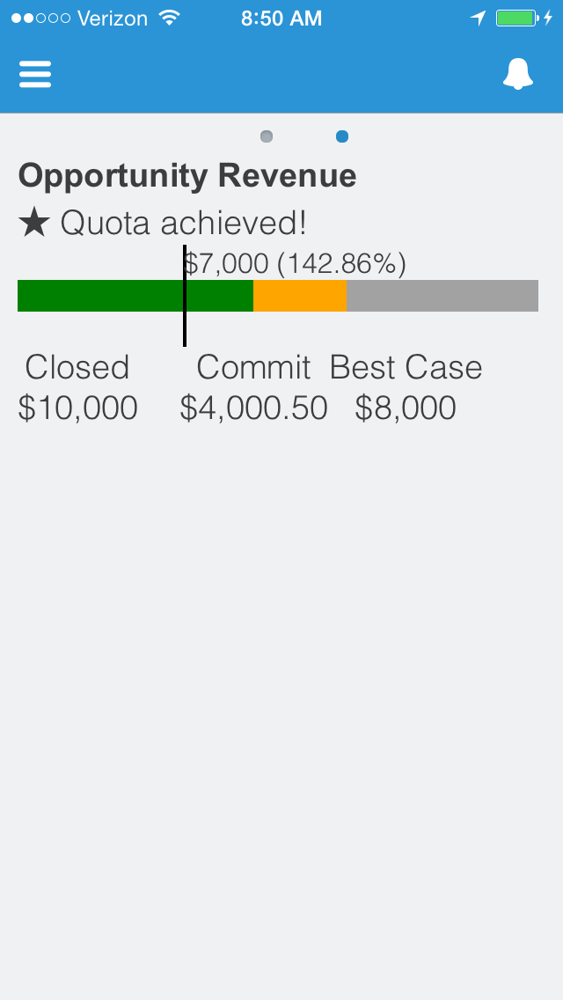
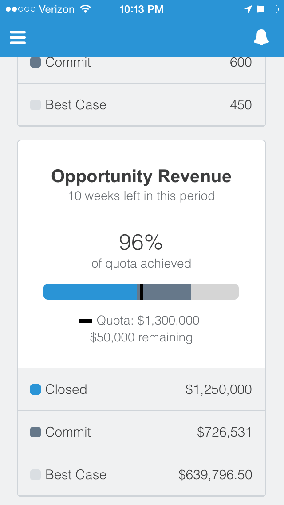

ForecastingMobileUI
===================

Post-installation steps:
You're almost done! Please follow these steps to include in the Salesforce1 navigation:
1. In Setup, go to "Salesforce1 Setup" at the top of the menu.
2. Under "Customizable Parts of the App", click on "Navigation Menu".
3. Move "My forecast" from Available to Selected, and click on Save.
